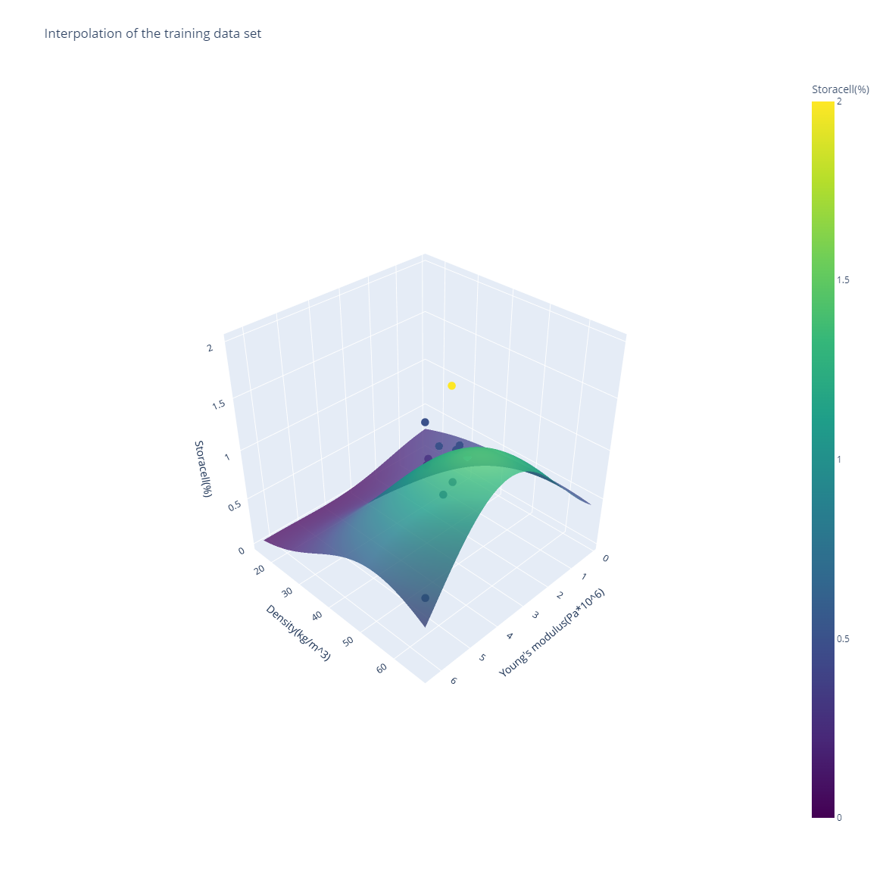

[](https://foamwoodproject.com/)

# GPR prediction program (website)

A program for predicting rheological and strength properties of FoamWood utilizing Gaussian Process Regression (GPR).

<figure>
  
  <figcaption>FoamWood can be used as a material in various products.</figcaption>
</figure>

<figure>
  
  <figcaption>Image of a 2D interpolation plot that the program outputs.</figcaption>
</figure>

<figure>
  
  <figcaption>Image of a 3D interpolation plot that the program outputs.</figcaption>
</figure>

# Requirements

1. Python
    - I used version 3.9.12 but others will probably work as well

2. All the packages listed in the beginning of
    - app.py
    - additional_methods.py
    - data_methods.py
    - layout_methods.py

The packages can be installed with pip for example.

3. A platform for deploying your website. The website runs fine like this locally on your computer, but if you want it on the internet, you need to use a platform such as Heroku for example. If you are using Heroku, I recommend to install the [Heroku Command Line Interface (CLI)](https://devcenter.heroku.com/articles/heroku-cli). The Heroku CLI can be used to for example look at error logs if your website is not working correctly:

```
heroku logs --app=gpr-prediction-program --tail
```

# Example

1. Navigate to the folder that you just downloaded from GitHub with the command
```
cd FILL-THIS-IN-YOURSELF\GPR-prediction-program-website-main
```

2. Launch the program with the command
```
python app.py
```

3. Open the website on your browser. The address is printed in your terminal:
```
Dash is running on COPY THIS INTO YOUR BROWSER

 * Serving Flask app 'app' (lazy loading)
 * Environment: production
   WARNING: This is a development server. Do not use it in a production deployment.
   Use a production WSGI server instead.
 * Debug mode: on
```

# Abilities of the website

1. Input variable(s)

You can add everything from 1 to 3 different inputs to the program.

2. Output variable

You can only have 1 output variable when running the program. This is the variable being predicted.

3. Override the built-in optimizer and fix length scale values

This button turns off the built-in optimizer. I don't recommend turning the button off (it is on by default). It is however there as an option for those who want to try it out.

4. Length scale(s)

The length scale values control the behaviour of the [RBF kernel](https://scikit-learn.org/stable/modules/generated/sklearn.gaussian_process.kernels.RBF.html) in the [GPR model](https://scikit-learn.org/stable/modules/generated/sklearn.gaussian_process.GaussianProcessRegressor.html). The length scale values have to always be larger than zero. Each length scale value corresponds to one input variable, and thus you should include either no arguments of this type (in which case they are inferred using a pretty good heuristic that is NOT the bad optimizer mentioned earlier), or alternatively the same number of arguments as the number of input variables.

5. Input value(s)

What if you want to know the predicted value of one specific point? Even though the figures give a good general picture of what's going on, you might want to know the predicted value of one specific point. Naturally here as well you have to have the same number of arguments as the number of input variables.

6. Validation set size

You might want to alter the ratio to which the training and validation set size are split to. The default for this is 0.1 (training set is 90% and validation set is 10%), but a larger validation set size might sometimes be desired especially when more data is gathered over time.

# Analysis

The error of the GPR model is printed on the website:

```
Relative training error: 34.167%

Relative validation error: 72.015%
```

PCA is also performed on the data.

# How to update the website on Heroku

This is really simple. Heroku is connected to this GitHub repository, and automatically updates itself when this repository is updated.

# How to add more data to the model

## DMTA data (rheology)

1. Add your data files to the "data" -folder

2. Parse your data files in data_methods.py

```
data = [
    pd.read_table('{}Rh_DMTA_000Storacell15Benecel_1Hz.txt'.format(path_1), decimal=',', comment='#', encoding='utf-16'),
    pd.read_table('{}Rh_DMTA_025Storacell15Benecel_1Hz.txt'.format(path_1), decimal=',', comment='#', encoding='utf-16'),
    # ...
    # PARSE YOUR DATA FILES HERE
]
```

## Compression test data

1. Hard code the compression test data to data_methods.py

```
yield_stress = [
    0.03973, 0.05190,
    # ...
    # ADD YOUR DATA HERE
]
yield_strain = [
    6.540, 6.274,
    # ...
    # ADD YOUR DATA HERE
]
youngs_modulus = [
    0.607, 1.098,
    # ...
    # ADD YOUR DATA HERE
]

conc_storacell = [
    0.00, 0.25,
    # ...
    # ADD YOUR DATA HERE
]
conc_benecel = [
    1.50, 1.50,
    # ...
    # ADD YOUR DATA HERE
]
lab_density = [
    20.11, 24.70,
    # ...
    # ADD YOUR DATA HERE
]
```

Note: Make sure that the new data is inserted in the same order in both the "data" -variable (DMTA data) as well as the "yield_stress", "yield_strain", ..., "lab_density" -variables (compression test data).

Note: If you have lots of data (too much to hard code) you can of course also just add the compression test data files to the "data" -folder and then instead of hard coding the data parse the data.

# How to add more variables to the model

As in the "Compression test data" -subsection, you can complete step 1 either by hard coding individual numbers or by parsing data files. We will be parsing data files in this example.

1. Add your data files to the "data" -folder

2. Parse your data files in data_methods.py

```
yield_stress = [
    0.03973, 0.05190,
    # ...
]
yield_strain = [
    6.540, 6.274,
    # ...
]
# ...
# ADD YOUR NEW VARIABLE HERE:
# new_variable = parsing_program(path)
```

Note: Make sure the new variable has the same amount of elements as all the other data variables. Your new variable should for example have the same number of elements as the "data" -variable.

3. Add the name of your variable to the "columns" -variable

```
columns = [
    'Min grad angle(rad/C)',
    'Storage modulus at min grad angle(Pa)',
    # ...
    # 'NAME OF NEW VARIABLE'
]
```

4. Add your new data variable to the return value of the "load_data" -method

```
return [min_grad_angle, storage_modulus_at_min_grad_angle, ..., new_variable], columns
```
